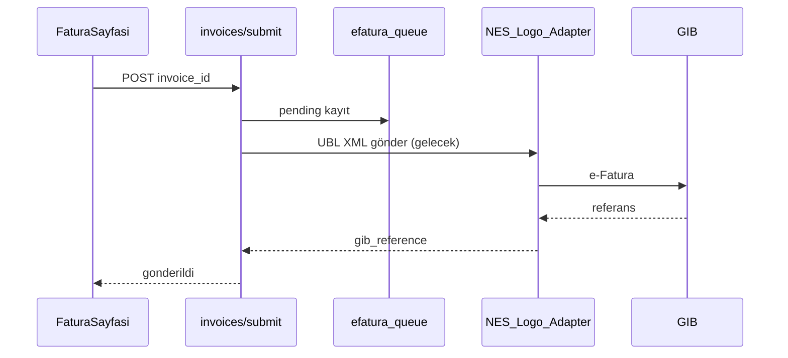

# e-Fatura Yol Haritası (maliyetsiz tasarım)

## Mevcut durum

- **Test modu:** Fatura GIB'e gönderilmez; `efatura_queue` tablosuna kayıt düşer.
- UI etiketi: **Test modu — GIB'e gönderilmez**
- Gerçek entegratör: gelir artınca NES veya Logo bağlanır.

## Akış (hedef)



## Entegratör karşılaştırması (tahmini)

| Sağlayıcı | Aylık maliyet | Not |
|-----------|---------------|-----|
| NES | ~₺500–1500 | Yaygın, API dokümantasyonu iyi |
| Logo | ~₺800–2000 | ERP entegrasyonu |
| Mikro | Değişken | Bayi anlaşmasına bağlı |

## Env checklist (prod)

```
EFATURA_PROVIDER=stub          # nes | logo
NES_EFATURA_API_KEY=           # NES seçilirse
LOGO_EFATURA_URL=              # Logo seçilirse
```

## Uygulama adımları (gelir sonrası)

1. `lib/efatura/ubl-builder.ts` — UBL-TR 1.2 XML
2. `lib/efatura/nes-adapter.ts` veya `logo-adapter.ts`
3. Cron worker: `efatura_queue` pending → HTTP gönder → retry
4. Webhook: GIB durum güncelleme

## Status eşlemesi

| DB | UI |
|----|-----|
| taslak | Taslak |
| submitted | Gönderildi |
| onaylandi | Onaylandı |
