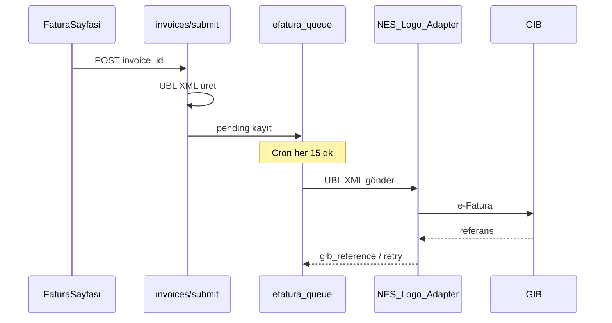

# e-Fatura Yol Haritası

## Mevcut durum

- **Test modu (varsayılan):** `EFATURA_PROVIDER=stub` — GIB'e gönderilmez; UBL-TR XML üretilir, `efatura_queue` + `invoices.xml_content` güncellenir.
- UI etiketi: **Test modu — GIB'e gönderilmez**
- **Uygulandı:** `ubl-builder.ts`, `nes-adapter.ts`, `logo-adapter.ts`, cron `/api/cron/efatura-queue` (15 dk)

## Akış



## Env checklist (prod)

```
EFATURA_PROVIDER=stub          # nes | logo
NES_EFATURA_API_KEY=           # NES seçilirse
NES_EFATURA_URL=               # opsiyonel
LOGO_EFATURA_URL=              # Logo seçilirse
LOGO_EFATURA_API_KEY=          # opsiyonel
CRON_SECRET=                   # kuyruk worker
```

## Dosyalar

| Dosya | Rol |
|-------|-----|
| `lib/efatura/ubl-builder.ts` | UBL-TR 1.2 XML |
| `lib/efatura/nes-adapter.ts` | NES HTTP |
| `lib/efatura/logo-adapter.ts` | Logo HTTP |
| `lib/efatura/provider.ts` | stub \| nes \| logo seçici |
| `app/api/cron/efatura-queue` | pending → submit / retry |

## Status eşlemesi

| DB | UI |
|----|-----|
| taslak | Taslak |
| submitted | Gönderildi |
| onaylandi | Onaylandı |

## Kalan (gerçek GIB)

1. ~~NES/Logo sandbox env + kuyruk UI~~ — `getEfaturaSandboxStatus` + Fatura sayfası kuyruk paneli + admin `efatura-queue` cron
2. GIB durum webhook / polling (adapter yanıtı sonrası status eşleme)
3. Entegratör PDF görüntüleme

Prod için: `EFATURA_PROVIDER=nes` (veya `logo`) + ilgili API anahtarları.
